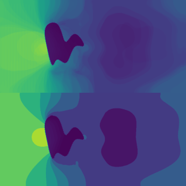
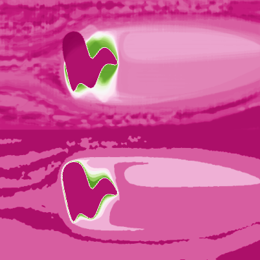
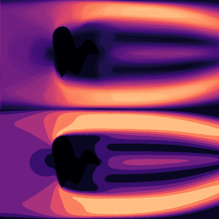

# StarGAN v2 for Computational Fluid Dynamics (CFD) 


> Code Base **StarGAN v2: Diverse Image Synthesis for Multiple Domains**<br>
> [Yunjey Choi](https://github.com/yunjey)\*, [Youngjung Uh](https://github.com/youngjung)\*, [Jaejun Yoo](http://jaejunyoo.blogspot.com/search/label/kr)\*, [Jung-Woo Ha](https://www.facebook.com/jungwoo.ha.921)<br>
Modified by Dingjie PENG, Waseda Unniversity, Japan


<!-- > **Abstract:** *A good image-to-image translation model should learn a mapping between different visual domains while satisfying the following properties: 1) diversity of generated images and 2) scalability over multiple domains. Existing methods address either of the issues, having limited diversity or multiple models for all domains. We propose StarGAN v2, a single framework that tackles both and shows significantly improved results over the baselines. Experiments on CelebA-HQ and a new animal faces dataset (AFHQ) validate our superiority in terms of visual quality, diversity, and scalability. To better assess image-to-image translation models, we release AFHQ, high-quality animal faces with large inter- and intra-domain variations. The code, pre-trained models, and dataset are available at clovaai/stargan-v2.* -->





## Software installation
Clone this repository:

```bash
git clone https://github.com/jungletada/CDF-StarGAN.git
cd CDF-StarGAN/
```

Install the dependencies:
```bash
conda create -n cfd python=3.6.7
conda activate cfd
conda install -y pytorch=1.4.0 torchvision=0.5.0 cudatoolkit=10.0 -c pytorch
conda install x264=='1!152.20180717' ffmpeg=4.0.2 -c conda-forge
pip install opencv-python==4.1.2.30 ffmpeg-python==0.2.0 scikit-image==0.16.2
pip install pillow==7.0.0 scipy==1.2.1 tqdm==4.43.0 munch==2.5.0
```

<!-- ## Datasets and pre-trained networks -->
<!-- We provide a script to download datasets used in StarGAN v2 and the corresponding pre-trained networks. The datasets and network checkpoints will be downloaded and stored in the `data` and `expr/checkpoints` directories, respectively. -->

## Training networks
To train StarGAN v2 from scratch, run the following commands. Generated images and network checkpoints will be stored in the `expr/samples` and `expr/checkpoints` directories, respectively. Training takes about three days on a single Tesla V100 GPU. Please see [here](https://github.com/clovaai/stargan-v2/blob/master/main.py#L86-L179) for training arguments and a description of them. 

```bash
python main.py \
      --mode train \
      --num_domains 4 \
      --w_hpf 1
```

## Evaluation metrics
To evaluate StarGAN v2 using [Fr&eacute;chet Inception Distance (FID)](https://arxiv.org/abs/1706.08500) and [Learned Perceptual Image Patch Similarity (LPIPS)](https://arxiv.org/abs/1801.03924), run the following commands:


```bash
python main.py \
        --mode eval \
        --num_domains 4 \
        --w_hpf 1 \
        --checkpoint_dir expr/checkpoints \
        --resume_iter 100000 \
        --eval_dir expr/eval
```

Note that the evaluation metrics are calculated using random latent vectors or reference images, both of which are selected by the [seed number](https://github.com/clovaai/stargan-v2/blob/master/main.py#L35). In the paper, we reported the average of values from 10 measurements using different seed numbers. The following table shows the calculated values for both latent-guided and reference-guided synthesis.
Evaluation Results:
| Domain |  MAE  |  RMSE  |  SSIM  |  PSNR  |
|--------|-------|--------|--------|--------|
| pressure | 0.0788 | 0.1001 |0.8346 | 19.9828 |
| temperature | 0.0783 | 0.1352 |0.7865 | 17.5058 |
| velocity | 0.1158 | 0.1538 |0.6275 | 16.5499 |


## License
The source code, pre-trained models, and dataset are available under [Creative Commons BY-NC 4.0](https://github.com/clovaai/stargan-v2/blob/master/LICENSE) license by NAVER Corporation. You can **use, copy, tranform and build upon** the material for **non-commercial purposes** as long as you give **appropriate credit** by citing our paper, and indicate if changes were made. 

<!-- For business inquiries, please contact clova-jobs@navercorp.com.<br/>	
For technical and other inquires, please contact yunjey.choi@navercorp.com. -->


## Citation
If you find this work useful for your research, please cite starganv2 paper:

```
@inproceedings{choi2020starganv2,
  title={StarGAN v2: Diverse Image Synthesis for Multiple Domains},
  author={Yunjey Choi and Youngjung Uh and Jaejun Yoo and Jung-Woo Ha},
  booktitle={Proceedings of the IEEE Conference on Computer Vision and Pattern Recognition},
  year={2020}
}
```